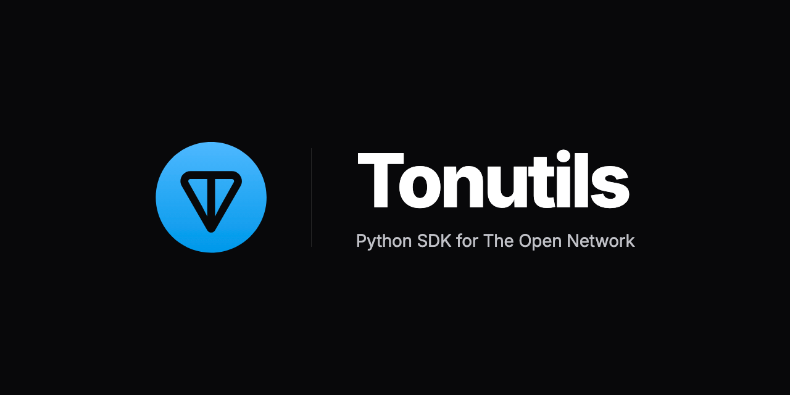

# 📦 Tonutils 2.0 [BETA]

[](https://ton.org)

[](https://pypi.org/project/tonutils/2.0.1b2/)
[](LICENSE)




**Tonutils** is a high-level, object-oriented Python library designed to simplify interactions with the TON blockchain.
It seamlessly integrates several prominent services for working with TON:

**Native ADNL:**

* Built-in ADNL-TCP lite-server client.

**HTTP API:**

* [toncenter.com](https://toncenter.com/) – Fast and reliable HTTP API for The Open Network.
* [tonapi.io](https://tonapi.io/) – REST API to the TON blockchain explorer.
* [chainstack](https://chainstack.com/) – Fast and Reliable Blockchain Infrastructure Provider.
* [tatum.io](https://tatum.io/) – RPCs and APIs powering Web3. Fast, reliable, affordable.
* [quicknode.com](https://www.quicknode.com/) – Low-latency HTTP API access to TON via global infrastructure.

By combining these services, `tonutils` provides a powerful and flexible toolset for developers, making it easier to
build on top of the TON ecosystem.

## Installation

```bash
pip install --pre tonutils
```

## Usage

Practical feature examples can be found in the **[examples](examples)** directory.\
Each script demonstrates real-world usage and can be used as a reference when integrating `tonutils` into your project.

## Contribution

We welcome your contributions! If you have ideas for improvement or have identified a bug, please create an issue or
submit a pull request.

## Donations

Your contributions help me continue developing and improving this project!

- **TON**: `UQCZq3_Vd21-4y4m7Wc-ej9NFOhh_qvdfAkAYAOHoQ__Ness`

- **BTC**: `1JXHbB5kE1DfkHdv5dsNygRkNC3unJdU8M`

- **USDT** (TRC-20): `TU4fCFdWufKb4rd25ihksiNDZZdyEYqro6`

- **Crypto Bot**: [Donate through Crypto Bot](https://t.me/send?start=IVW1cyG3DYqG)

- **xRocket Bot**: [Donate through xRocket](https://t.me/xrocket?start=inv_R4llrClZtPjovVe)

## Support

Supported by [TON Society](https://github.com/ton-society/grants-and-bounties), Grants and Bounties program.\
With special thanks to [Igroman787](https://github.com/Igroman787) for the support.

## License

This repository is distributed under the [MIT License](LICENSE).
Feel free to use, modify, and distribute the code in accordance with the terms of the license.
