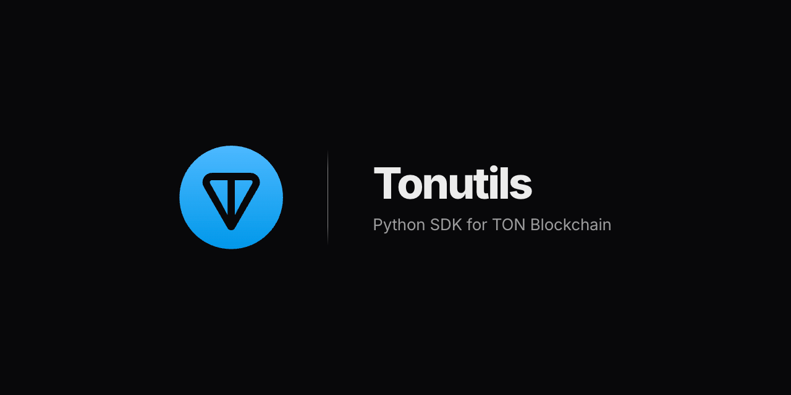

# 📦 Tonutils

[](https://ton.org)

[](https://pypi.python.org/pypi/tonutils)
[](LICENSE)
[](https://tonviewer.com/UQCZq3_Vd21-4y4m7Wc-ej9NFOhh_qvdfAkAYAOHoQ__Ness)




### Python SDK for [The Open Network](https://ton.org)

Interact with the TON blockchain ecosystem via lite servers (ADNL) and HTTP API providers.

**Supported providers**

- [toncenter.com](https://toncenter.com/) – Fast and reliable HTTP API for The Open Network
- [tonapi.io](https://tonapi.io/) – REST API to the TON blockchain explorer
- [chainstack](https://chainstack.com/) – Fast and Reliable Blockchain Infrastructure Provider
- [tatum.io](https://tatum.io/) – RPCs and APIs powering Web3. Fast, reliable, affordable
- [quicknode.com](https://www.quicknode.com/) – Low-latency HTTP API access to TON via global infrastructure

> If this project has been useful to you, consider supporting its development.  
> **TON**: `UQCZq3_Vd21-4y4m7Wc-ej9NFOhh_qvdfAkAYAOHoQ__Ness`

## Installation

```bash
pip install tonutils
```

## Examples

Check out the **[examples](examples)** directory for practical usage across all features.

<details>
<summary>Show all examples</summary>

- [Client initialization](examples/client/)
- [Create Wallet](examples/wallet/create_wallet.py)
- [Import Wallet](examples/wallet/import_wallet.py)
- [Deploy Wallet](examples/wallet/deploy_wallet.py)
- [Wallet Info](examples/wallet/wallet_info.py)
- [TON Transfer](examples/wallet/ton_transfer.py)
- [Jetton Transfer](examples/wallet/jetton_transfer.py)
- [NFT Transfer](examples/wallet/nft_transfer.py)
- [Batch Transfer](examples/wallet/batch_transfer.py)
- [Gasless Transfer](examples/wallet/gasless_transfer.py)
- [Encrypt Message](examples/wallet/encrypt_message.py)
- [Decrypt Message](examples/wallet/decrypt_message.py)
- [Vanity Contract](examples/vanity/deploy_contract.py)
- [Block Scanner](examples/block_scanner.py)

**Jetton**

- [Stablecoin](examples/jetton/stablecoin/)
- [Standard](examples/jetton/standard/)

**NFT**

- [Editable](examples/nft/editable/)
- [Soulbound](examples/nft/soulbound/)
- [Standard](examples/nft/standard/)

**DNS**

- [Resolve](examples/dns/dns_resolve.py)
- [Get Records](examples/dns/get_records.py)
- [Set Records](examples/dns/set_records.py)

**TON Connect**

- [Connect Wallet](examples/tonconnect/connect_wallet/ton_addr.py)
- [Connect Wallet with TON Proof](examples/tonconnect/connect_wallet/ton_proof.py)
- [Send Transaction](examples/tonconnect/send_request/transaction.py)
- [Sign Data](examples/tonconnect/send_request/sign_data.py)
- [Check TON Proof](examples/tonconnect/check_ton_proof.py)
- [Check Sign Data](examples/tonconnect/check_sign_data.py)
- [Import Connection](examples/tonconnect/import_connection.py)

</details>

## CLI

Show version:

```bash
tonutils -v
```

Monitor lite-server availability:

```bash
tonutils status [-n mainnet|testnet] [-c PATH_OR_URL] [-r RPS]
```

## License

This repository is distributed under the [MIT License](LICENSE).
